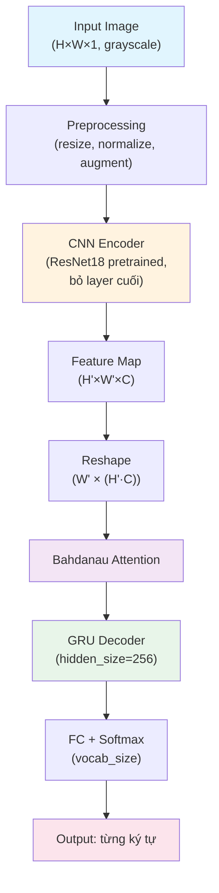

# Phân Tích Mô Hình Cho Word-Level Handwritten Text Recognition

## Tổng Quan Dataset

| Thông số | Giá trị |
|---|---|
| Tổng số mẫu | ~115,319 word images |
| Format label | `path\tword` (TSV) |
| Nguồn gốc | IAM Handwriting Dataset |
| Ngôn ngữ | Tiếng Anh |
| Đặc điểm | Chữ viết tay nhiều phong cách, có cả chữ in hoa, thường, dấu câu |

---

## 1. CNN + BiLSTM + CTC Loss

### Ý tưởng hoạt động

```
Ảnh → CNN (trích xuất feature) → BiLSTM (mô hình hóa chuỗi) → CTC Loss (align output)
```

CNN trích xuất feature map từ ảnh, sau đó "ép" chiều height thành 1 để tạo chuỗi feature theo chiều width. BiLSTM đọc chuỗi feature này theo cả 2 chiều (trái→phải, phải→trái). CTC Loss cho phép train mà **không cần alignment** giữa input và output — model tự học cách map feature frames → ký tự.

### Ưu điểm
- ✅ Kiến trúc đơn giản, dễ hiểu, tài liệu nhiều
- ✅ Không cần alignment data (CTC tự xử lý)
- ✅ Train nhanh, hội tụ khá nhanh trên dataset cỡ IAM
- ✅ Là baseline kinh điển — dễ trích dẫn paper (Shi et al., CRNN 2016)

### Nhược điểm
- ❌ **CTC giả định independence giữa các output** — nó không biết ký tự trước là gì khi predict ký tự tiếp
- ❌ **Không có cơ chế attention** — không thể "nhìn lại" vùng ảnh quan trọng
- ❌ Feature trích xuất theo cột dọc cố định → nếu chữ nghiêng, ngoáy, dính nét → cột feature bị nhiễu
- ❌ CTC decode bằng greedy hoặc beam search **không có language model** → dễ ra nonsense
- ❌ **Đây chính là hướng bạn đã thử và không hiệu quả**

### Đánh giá tổng hợp

| Tiêu chí | Đánh giá |
|---|---|
| Độ khó code | ⭐⭐ Dễ |
| Phù hợp word-level HTR | ⭐⭐⭐ Trung bình |
| Chạy RTX 4060 | ⭐⭐⭐⭐⭐ Rất nhẹ |
| Giải thích khi bảo vệ | ⭐⭐⭐⭐ Dễ giải thích |
| Chịu ảnh mờ/ngoáy/crop xấu | ⭐⭐ Yếu |

> [!WARNING]
> **Bạn đã thử hướng này và kết quả không tốt.** Nguyên nhân chính là CTC loss thiếu context awareness — nó predict mỗi time step độc lập, rất yếu khi gặp chữ ngoáy hoặc ambiguous. Tuy nhiên, nó vẫn phù hợp làm **baseline** để so sánh.

### Kết luận: **Dùng làm BASELINE, không nên làm hướng chính**

---

## 2. CNN Encoder + GRU/LSTM Attention Decoder (Seq2Seq with Attention)

### Ý tưởng hoạt động

```
Ảnh → CNN Encoder (feature map 2D) → Attention Mechanism → GRU/LSTM Decoder (sinh ký tự từng bước)
```

Khác biệt cốt lõi so với CTC: **Decoder sinh ký tự từng bước một**, mỗi bước nó:
1. Nhìn vào hidden state trước đó (biết ký tự vừa sinh là gì)
2. Tính **attention weights** trên toàn bộ feature map → biết nên "nhìn vào đâu" trên ảnh
3. Kết hợp context vector + hidden state → sinh ký tự tiếp theo

Có thể dùng **Bahdanau Attention** (additive) hoặc **Luong Attention** (dot-product). Bahdanau phổ biến hơn cho HTR vì linh hoạt hơn.

### Ưu điểm
- ✅ **Attention cho phép model "nhìn" vào đúng vùng ảnh** khi sinh mỗi ký tự → xử lý chữ ngoáy, dính nét tốt hơn nhiều
- ✅ **Decoder biết context** — ký tự trước ảnh hưởng ký tự sau → ít ra nonsense hơn CTC
- ✅ **Có thể visualize attention map** → giải thích rất trực quan khi bảo vệ ("model đang nhìn vào đâu khi predict ký tự này")
- ✅ Có thể dùng **Teacher Forcing** khi train → hội tụ nhanh, ổn định
- ✅ Kiến trúc flexible — dễ thay đổi CNN backbone, thêm positional encoding, v.v.
- ✅ Paper tham khảo phong phú (Show, Attend and Read; Attention-based HTR)

### Nhược điểm
- ⚠️ Code phức tạp hơn CTC (viết Attention + Decoder loop + Teacher Forcing)
- ⚠️ Train chậm hơn CTC vì decode tuần tự (autoregressive)
- ⚠️ Cần xử lý `<SOS>`, `<EOS>`, `<PAD>` tokens
- ⚠️ Nếu attention bị misalign ở bước đầu → lỗi có thể lan truyền (exposure bias)
- ⚠️ Cần tune learning rate cẩn thận hơn

### Đánh giá tổng hợp

| Tiêu chí | Đánh giá |
|---|---|
| Độ khó code | ⭐⭐⭐ Trung bình |
| Phù hợp word-level HTR | ⭐⭐⭐⭐⭐ Rất tốt |
| Chạy RTX 4060 | ⭐⭐⭐⭐ Tốt (8GB VRAM đủ) |
| Giải thích khi bảo vệ | ⭐⭐⭐⭐⭐ Xuất sắc (attention map!) |
| Chịu ảnh mờ/ngoáy/crop xấu | ⭐⭐⭐⭐ Tốt |

> [!TIP]
> **Đây là điểm mạnh nhất để bảo vệ:** Bạn có thể show attention heatmap overlay lên ảnh gốc, chứng minh model "đang nhìn đúng chỗ" khi predict mỗi ký tự. Đây là thứ rất ấn tượng trong bài bảo vệ và dễ giải thích cho người không chuyên.

### Kết luận: **⭐ ĐỀ XUẤT LÀM HƯỚNG CHÍNH ⭐**

---

## 3. Transformer-Based Model Tự Xây

### Ý tưởng hoạt động

```
Ảnh → CNN/ViT Encoder (patch embedding) → Transformer Encoder (self-attention) → Transformer Decoder (cross-attention + autoregressive)
```

Thay thế toàn bộ RNN bằng Transformer. Encoder dùng self-attention trên patches/feature columns, Decoder dùng cross-attention + masked self-attention để sinh ký tự.

### Ưu điểm
- ✅ Capture long-range dependencies tốt hơn RNN
- ✅ Parallelizable trong training (không phải decode tuần tự khi train nhờ teacher forcing)
- ✅ State-of-the-art trên nhiều benchmark OCR
- ✅ Có thể dùng multi-head attention → phong phú hơn single attention

### Nhược điểm
- ❌ **Rất khó code đúng từ đầu** — positional encoding, masking, learning rate warmup, label smoothing
- ❌ **Cần data rất nhiều** — 115K samples có thể không đủ cho Transformer hoạt động tốt
- ❌ **Overfitting nghiêm trọng** trên dataset nhỏ nếu không regularize mạnh
- ❌ **Khó debug** — attention multi-head khó visualize bằng single-head
- ❌ Giải thích khi bảo vệ phức tạp hơn nhiều
- ❌ Cần tune nhiều hyperparameter: num heads, num layers, d_model, warmup steps, dropout

### Đánh giá tổng hợp

| Tiêu chí | Đánh giá |
|---|---|
| Độ khó code | ⭐⭐⭐⭐⭐ Rất khó |
| Phù hợp word-level HTR | ⭐⭐⭐ Trung bình (thiếu data) |
| Chạy RTX 4060 | ⭐⭐⭐ OK nếu model nhỏ |
| Giải thích khi bảo vệ | ⭐⭐ Khó giải thích |
| Chịu ảnh mờ/ngoáy/crop xấu | ⭐⭐⭐ Phụ thuộc data size |

> [!CAUTION]
> Transformer cần dữ liệu lớn (hàng triệu mẫu) để phát huy. Với ~115K mẫu của IAM, bạn rất dễ bị overfitting. Ngoài ra, nếu bạn chưa quen deep learning, việc tự implement Transformer từ đầu là rủi ro cao — dễ mắc lỗi subtle mà rất khó debug.

### Kết luận: **Không nên chọn — quá phức tạp, thiếu data, rủi ro cao cho sinh viên**

---

## 4. Word-Level Classifier (Nếu Vocabulary Cố Định)

### Ý tưởng hoạt động

```
Ảnh → CNN (feature extraction) → Fully Connected → Softmax (chọn 1 trong N từ)
```

Coi mỗi từ là 1 class. Nếu vocab = 5,000 từ → output layer = 5,000 neurons. Model chỉ cần classify, không cần decode ký tự.

### Ưu điểm
- ✅ **Cực kỳ đơn giản** — chỉ là image classification
- ✅ Train rất nhanh
- ✅ Có thể dùng pretrained model (ResNet, EfficientNet) trực tiếp
- ✅ Dễ giải thích

### Nhược điểm
- ❌ **Không generalize** — chỉ nhận được từ đã có trong training vocab
- ❌ Từ mới (unseen word) → predict sai 100%
- ❌ Vocab IAM rất lớn (~10,000+ unique words) → class imbalance nghiêm trọng
- ❌ Nhiều từ chỉ xuất hiện 1-2 lần → không đủ data để học
- ❌ **Không phải recognition thực sự** — đây là classification, hội đồng bảo vệ có thể đánh giá thấp

### Phân tích vocab dataset

Nhìn vào dataset, có rất nhiều từ rare: tên riêng (Gaitskell, Welensky, Nkumbula), từ ghép (Foot-Griffiths, Left-wing), abbreviations — những từ này không thể classify được.

### Đánh giá tổng hợp

| Tiêu chí | Đánh giá |
|---|---|
| Độ khó code | ⭐ Rất dễ |
| Phù hợp word-level HTR | ⭐ Rất kém |
| Chạy RTX 4060 | ⭐⭐⭐⭐⭐ Rất nhẹ |
| Giải thích khi bảo vệ | ⭐⭐⭐ Dễ nhưng bị đánh giá thấp |
| Chịu ảnh mờ/ngoáy/crop xấu | ⭐⭐ Yếu |

> [!CAUTION]
> Hướng này **không phải HTR thực sự**. Nếu vocabulary mở (open vocabulary) — mà IAM dataset là open vocab — thì hướng này không khả thi. Không nên dùng làm hướng chính hay baseline.

### Kết luận: **Không nên dùng — bản chất sai với bài toán**

---

## 5. Transfer Learning + CNN Backbone + Decoder Tự Code

### Ý tưởng hoạt động

```
Ảnh → Pretrained CNN (ResNet18/MobileNetV2/EfficientNet-B0) → Feature Map → Decoder tự code (Attention hoặc CTC)
```

Thay vì train CNN from scratch, dùng backbone pretrained trên ImageNet. Freeze hoặc fine-tune các layer đầu, chỉ train decoder.

### Ưu điểm
- ✅ **CNN backbone đã học feature extraction rất tốt** — edges, textures, shapes
- ✅ Hội tụ nhanh hơn train from scratch
- ✅ Ít bị overfitting hơn (backbone đã generalize)
- ✅ Backbone nhẹ như MobileNetV2 chạy cực nhanh trên RTX 4060
- ✅ **Dễ giải thích**: "Tôi tận dụng feature extraction của model đã train trên hàng triệu ảnh ImageNet, chỉ train phần nhận dạng chữ"

### Nhược điểm
- ⚠️ ImageNet features ≠ Handwriting features — cần fine-tune, không chỉ freeze
- ⚠️ Pretrained model thường output spatial resolution thấp → cần điều chỉnh stride/pooling
- ⚠️ Một số backbone (ResNet50+, EfficientNet-B4+) quá nặng → không cần thiết cho word images nhỏ

### Backbone nên chọn

| Backbone | Params | Tốc độ | Chất lượng feature | Khuyến nghị |
|---|---|---|---|---|
| ResNet18 | 11M | Nhanh | Tốt | ✅ Khuyên dùng |
| MobileNetV2 | 3.4M | Rất nhanh | Khá | ✅ Nếu cần nhẹ |
| EfficientNet-B0 | 5.3M | Nhanh | Rất tốt | ✅ Lựa chọn tốt nhất |
| ResNet50 | 25M | Trung bình | Rất tốt | ⚠️ Overkill |
| EfficientNet-B4+ | 19M+ | Chậm | Xuất sắc | ❌ Quá nặng |

### Đánh giá tổng hợp

| Tiêu chí | Đánh giá |
|---|---|
| Độ khó code | ⭐⭐⭐ Trung bình |
| Phù hợp word-level HTR | ⭐⭐⭐⭐ Tốt (kết hợp với Attention Decoder) |
| Chạy RTX 4060 | ⭐⭐⭐⭐⭐ Rất tốt |
| Giải thích khi bảo vệ | ⭐⭐⭐⭐⭐ Transfer learning rất dễ giải thích |
| Chịu ảnh mờ/ngoáy/crop xấu | ⭐⭐⭐⭐ Tốt (pretrained features robust hơn) |

> [!IMPORTANT]
> **Transfer learning KHÔNG phải một kiến trúc riêng** — nó là kỹ thuật áp dụng vào phần CNN encoder. Khuyến nghị: **kết hợp Transfer Learning (backbone) + Attention Decoder** = hướng chính tối ưu nhất.

### Kết luận: **Nên dùng làm phần CNN encoder cho hướng chính**

---

## Bảng So Sánh Tổng Hợp

| Tiêu chí | CNN+BiLSTM+CTC | CNN+Attn Decoder | Transformer | Word Classifier | Transfer+Decoder |
|---|---|---|---|---|---|
| Độ khó code | ⭐⭐ | ⭐⭐⭐ | ⭐⭐⭐⭐⭐ | ⭐ | ⭐⭐⭐ |
| Chất lượng dự đoán | Trung bình | **Tốt** | Phụ thuộc data | Kém | **Tốt** |
| Chịu ảnh xấu | Yếu | **Tốt** | Trung bình | Yếu | **Tốt** |
| Giải thích bảo vệ | Dễ | **Xuất sắc** | Khó | Dễ nhưng bị đánh giá thấp | **Xuất sắc** |
| RTX 4060 | ✅✅✅ | ✅✅ | ✅ | ✅✅✅ | ✅✅ |
| Nên dùng làm | Baseline | **Hướng chính** | Không nên | Không nên | **Kết hợp vào hướng chính** |

---

## KHUYẾN NGHỊ CUỐI CÙNG

### ⭐ Hướng chính: CNN Encoder (Pretrained) + Attention Decoder

```
Ảnh → Preprocessing → ResNet18/EfficientNet-B0 (pretrained, fine-tune) 
  → Feature Map → Bahdanau Attention → GRU Decoder → Ký tự từng bước → Từ hoàn chỉnh
```

**Lý do chọn:**
1. **Attention Decoder giải quyết đúng vấn đề bạn gặp** — chữ ngoáy, mờ, dính nét
2. **Transfer learning** giúp CNN encoder trích xuất feature tốt hơn train from scratch
3. **Attention map** = vũ khí bảo vệ — giải thích trực quan, ấn tượng
4. **Vừa sức sinh viên** — không quá đơn giản (bị đánh giá thấp) cũng không quá phức tạp (rủi ro)
5. **Chạy thoải mái trên RTX 4060** 8GB VRAM

### 📊 Baseline: CNN + BiLSTM + CTC

Dùng hướng CRNN cũ làm baseline để so sánh. Bạn đã có kinh nghiệm với hướng này, chỉ cần clean up code, train lại cùng dataset, cùng augmentation → có số liệu so sánh.

---

## CTC vs Attention Decoder — Phân Tích Chi Tiết

### Tại sao nên tránh CTC làm hướng chính?

| Vấn đề | CTC | Attention Decoder |
|---|---|---|
| Ký tự dính nét | Feature columns bị nhiễu → sai | Attention "nhìn" vùng ảnh cần thiết → đúng hơn |
| Chữ ngoáy | Alignment cứng theo column → sai | Attention linh hoạt, skip/revisit vùng ảnh |
| Context ký tự trước | Không biết (conditional independence) | Decoder biết rõ (autoregressive) |
| Từ dài | Dễ bị repeat/skip ký tự | Ít lỗi hơn nhờ attention tracking |
| Decode strategy | Greedy/Beam search không có LM | Decoder tự "nhúng" implicit LM qua training |

### Attention Decoder lợi thế cụ thể ở đâu?

1. **Implicit Language Model**: Decoder GRU/LSTM tự học xác suất ký tự tiếp theo dựa trên context trước đó. Ví dụ: sau "th" nó biết khả năng cao là "e", "a", "i" — CTC không biết điều này.

2. **Spatial Awareness**: Attention weights cho model biết "nên nhìn vào pixel nào" cho mỗi ký tự. Với chữ ngoáy, attention có thể "nhảy" qua vùng không quan trọng.

3. **Robust với misalignment**: Ảnh bị crop lệch, có padding không đều → CTC bị ảnh hưởng nặng vì nó decode theo thứ tự cột. Attention có thể bỏ qua padding và tập trung vào vùng có chữ.

---

## Metrics Nên Dùng

| Metric | Ý nghĩa | Ưu tiên |
|---|---|---|
| **Word Accuracy (WA)** | % từ predict đúng hoàn toàn (exact match) | ⭐ Metric chính |
| **Character Error Rate (CER)** | Tỷ lệ lỗi ở mức ký tự (edit distance / total chars) | ⭐ Metric phụ quan trọng |
| **Normalized Edit Distance (NED)** | Edit distance chuẩn hóa theo chiều dài từ | ⭐ Metric phụ |

### Cách tính
```
Word Accuracy = (Số từ đúng hoàn toàn) / (Tổng số từ) × 100%

CER = Σ edit_distance(predicted, ground_truth) / Σ len(ground_truth) × 100%

NED = 1 - Σ (edit_distance(pred, gt) / max(len(pred), len(gt))) / N
```

> [!TIP]
> **Khi bảo vệ**: Trình bày cả 3 metrics. Word Accuracy cho thấy hiệu quả thực tế. CER cho thấy dù predict sai từ nhưng model vẫn "gần đúng" (ví dụ predict "helo" thay vì "hello" — WA = 0% nhưng CER chỉ ~20%). NED giúp so sánh công bằng giữa từ ngắn và từ dài.

---

## Preprocessing Khuyến Nghị

### Bắt buộc

| Bước | Mô tả | Lý do |
|---|---|---|
| **Grayscale conversion** | Chuyển ảnh RGB → grayscale (1 channel) | Chữ viết tay không cần thông tin màu, giảm noise |
| **Resize chuẩn hóa** | Resize về chiều cao cố định (ví dụ 64px), giữ nguyên aspect ratio, pad width | Đảm bảo input size đồng nhất |
| **Normalize pixel** | Scale pixel về [0, 1] hoặc [-1, 1] | Chuẩn hóa giúp train ổn định |
| **Binarization nhẹ** | Otsu thresholding hoặc adaptive thresholding | Tăng contrast giữa chữ và nền |

### Khuyến nghị thêm

| Bước | Mô tả |
|---|---|
| **Deskew** | Chỉnh ảnh bị nghiêng (tính slant angle → xoay lại) |
| **Remove border** | Cắt bỏ viền trắng/đen thừa xung quanh |
| **Noise removal** | Median filter nhẹ để giảm noise mà không mất nét chữ |

---

## Data Augmentation Khuyến Nghị

> [!IMPORTANT]
> Augmentation là **cực kỳ quan trọng** cho HTR. Nó mô phỏng các biến thể thực tế: chữ nghiêng, mờ, ảnh chụp xấu — giúp model robust hơn rất nhiều.

### Augmentation Pipeline (theo thứ tự ưu tiên)

| Augmentation | Tham số gợi ý | Tác dụng |
|---|---|---|
| **Random Rotation** | ±5° đến ±10° | Mô phỏng chữ viết nghiêng |
| **Random Affine/Shear** | shear ±10° | Mô phỏng chữ ngoáy, biến dạng |
| **Elastic Distortion** | alpha=34, sigma=4 | **Quan trọng nhất** — mô phỏng biến dạng chữ viết tay tự nhiên |
| **Gaussian Blur** | kernel 1-3 | Mô phỏng ảnh mờ |
| **Gaussian Noise** | σ = 0.01-0.05 | Mô phỏng noise từ scanner/camera |
| **Random Erosion/Dilation** | kernel 1-2 | Mô phỏng nét mực đậm/nhạt |
| **Brightness/Contrast jitter** | ±20% | Mô phỏng điều kiện ánh sáng khác nhau |
| **Random Crop/Pad** | ±5px | Mô phỏng crop không chuẩn |

### Augmentation KHÔNG nên dùng

| Augmentation | Lý do |
|---|---|
| Horizontal Flip | Chữ bị ngược → vô nghĩa |
| Vertical Flip | Chữ bị lộn → vô nghĩa |
| Color Jitter mạnh | Chữ viết tay thường grayscale |
| Random Crop lớn | Cắt mất ký tự |
| Rotation > 15° | Chữ bị quá nghiêng, không thực tế |

---

## Transfer Learning — Nên Dùng Ở Đâu?

### Chỉ dùng ở phần CNN Encoder

```
[Pretrained CNN - ResNet18/EfficientNet-B0]  ←  Transfer Learning áp dụng ở đây
                    ↓
          [Feature Map 2D]
                    ↓
    [Attention + GRU Decoder]  ←  Train from scratch (vì task-specific)
```

### Chiến lược fine-tune

| Giai đoạn | Thao tác | Epochs |
|---|---|---|
| Phase 1 | Freeze toàn bộ CNN backbone, chỉ train decoder | 5-10 epochs |
| Phase 2 | Unfreeze 2-3 layer cuối CNN, train toàn bộ với LR thấp hơn | 20-30 epochs |
| Phase 3 | Unfreeze toàn bộ, LR rất thấp (1e-5) | Fine-tune thêm nếu cần |

> [!TIP]
> Cách tiếp cận 2 phase này gọi là **gradual unfreezing** (Howard & Ruder, 2018). Nó giúp:
> - Phase 1: Decoder hội tụ nhanh trên feature đã tốt sẵn
> - Phase 2: CNN backbone adapt từ ImageNet features → handwriting features
> - Tránh "catastrophic forgetting" — phá hỏng pretrained weights

### Tại sao KHÔNG dùng transfer learning cho Decoder?

Decoder (Attention + GRU) phải sinh ký tự theo trình tự cụ thể cho task HTR — **không có pretrained decoder nào phù hợp** (ImageNet classifier không decode chuỗi ký tự). Decoder phải train from scratch, nhưng điều này OK vì decoder nhẹ và dataset 115K đủ để train.

---

## Kiến Trúc Đề Xuất Chi Tiết



### Hyperparameters khuyến nghị

| Parameter | Giá trị khuyến nghị |
|---|---|
| Image height | 64 px |
| Image max width | 256 px (pad nếu ngắn hơn) |
| CNN backbone | ResNet18 (pretrained ImageNet) |
| Decoder type | GRU (1 layer) |
| Hidden size | 256 |
| Embedding size | 128 |
| Attention type | Bahdanau (Additive) |
| Batch size | 64 |
| Optimizer | Adam |
| Learning rate (decoder) | 1e-3 |
| Learning rate (encoder fine-tune) | 1e-5 |
| Teacher forcing ratio | 0.5 → giảm dần |
| Max decode length | 32 ký tự |
| Epochs | 50-80 |

---

## Rủi Ro Và Cách Giảm Thiểu

| Rủi ro | Giải pháp |
|---|---|
| Ảnh mờ, noise nhiều | Augmentation với Gaussian blur + noise khi train |
| Chữ ngoáy, dính nét | Elastic distortion augmentation + Attention mechanism |
| Crop không chuẩn | Random crop/pad augmentation + remove border preprocessing |
| Overfitting | Dropout 0.3-0.5, early stopping, augmentation mạnh |
| Exposure bias (Attention Decoder) | Scheduled sampling — giảm teacher forcing dần |
| Từ rare/tên riêng | Character-level decoding (không cần biết từ, chỉ cần biết ký tự) |
| Label noise trong IAM | Lọc bỏ samples có label quá ngắn (1 char) hoặc quá dài (>25 chars) nếu cần |

---

## Tóm Tắt Quyết Định

| Quyết định | Lựa chọn |
|---|---|
| **Hướng chính** | CNN (ResNet18 pretrained) + Bahdanau Attention + GRU Decoder |
| **Baseline** | CNN + BiLSTM + CTC (CRNN) |
| **Metric chính** | Word Accuracy + CER |
| **Transfer learning** | Có, chỉ ở CNN encoder (ResNet18 pretrained ImageNet) |
| **Augmentation quan trọng nhất** | Elastic Distortion + Random Affine + Gaussian Blur |
| **Framework** | PyTorch (linh hoạt hơn, debug dễ hơn) |
| **Nên tránh** | CTC làm hướng chính, Transformer tự xây, Word Classifier |
