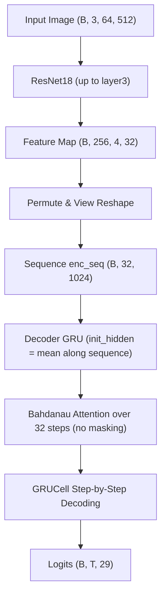
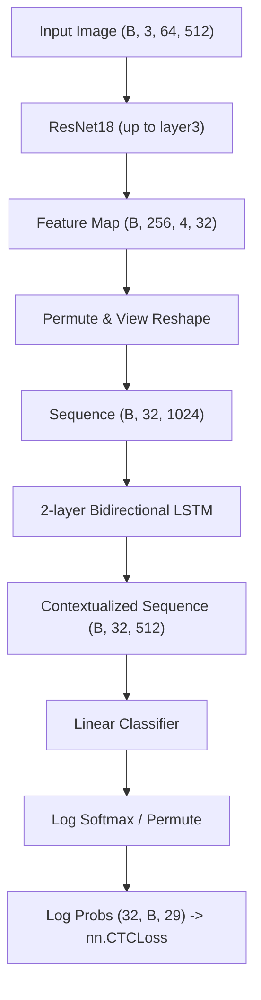

# BÁO CÁO KIỂM TOÁN HỆ THỐNG PIPELINE NHẬN DẠNG CHỮ VIẾT TAY (HTR)

Báo cáo này kiểm toán chi tiết hai pipeline hiện tại trong dự án `HRT-Project`:
1. **Pipeline mô hình Attention** (`AttentionHTR`): Sử dụng Encoder ResNet18 kết hợp Decoder GRUCell cùng cơ chế Bahdanau Additive Attention.
2. **Pipeline mô hình Baseline không có Attention** (`CTCBaseline`): Sử dụng Encoder ResNet18 kết hợp mạng hồi quy 2 chiều BiLSTM và hàm mất mát CTC (Connectionist Temporal Classification).

Mục tiêu là phân tích nguyên nhân tại sao mô hình Baseline (CTC) hiện tại đạt hiệu năng tốt hơn đáng kể so với mô hình Attention.

---

## 1. Tóm tắt kết quả kiểm toán (Summary)

Qua quá trình quét mã nguồn, phân tích dữ liệu và chạy thực tế các tệp đánh giá trên tập kiểm thử (test set), chúng tôi ghi nhận kết quả như sau:
*   **Mô hình CTC Baseline** vượt trội hơn mô hình Attention cả về độ chính xác từ (Word Accuracy) và tỷ lệ lỗi ký tự (Character Error Rate - CER).
*   **Hiệu năng thực tế trên Test Set:**
    *   **CTC Baseline:** Word Accuracy = **80.89%** | CER = **7.25%**
    *   **Attention Model:** Word Accuracy = **73.24%** | CER = **12.05%**
*   **Nguyên nhân cốt lõi:**
    1.  *Thiếu lớp hồi quy tuần tự ở phía Encoder của mô hình Attention:* Khác với CTC Baseline có thêm 2 lớp BiLSTM giúp tích hợp thông tin ngữ cảnh hai chiều toàn cục, mô hình Attention gửi trực tiếp đặc trưng local từ ResNet đến Decoder. Điều này khiến cho Attention Decoder rất khó học căn chỉnh ký tự (alignment).
    2.  *Không áp dụng mặt nạ đệm ảnh (Padding Masking) trong Attention:* Ảnh được đệm khoảng trắng lớn ở phía bên phải (để đạt chiều rộng 512). Phân phối Attention tính trên toàn bộ 32 bước (bao gồm cả các bước đệm) mà không được che đi (masked), dẫn đến hiện tượng trôi Attention (Attention drift/collapse).
    3.  *Sự khác biệt về Tốc độ Học (Learning Rate) của Encoder:* Trong khi CTC Baseline fine-tune Encoder với Learning Rate $10^{-3}$, mô hình Attention chỉ fine-tune Encoder với Learning Rate rất nhỏ $5 \times 10^{-5}$, làm Encoder của Attention thích nghi kém hơn với tập dữ liệu viết tay.

---

## 2. Kiểm tra Môi trường (Environment Check)

Kết quả chạy các câu lệnh kiểm tra môi trường trên thiết bị:
*   **Đường dẫn Python:** `C:\conda_envs\hrt\python.exe`
*   **Phiên bản Python:** `3.11.15`
*   **Thư viện PyTorch:** `2.12.0+cu130`
*   **Phiên bản CUDA:** `13.0`
*   **GPU khả dụng:** `True` (Tên GPU: `NVIDIA GeForce RTX 5060 Ti`)

---

## 3. So sánh Dữ liệu và Tiền xử lý (Dataset & Preprocessing)

1.  **Các tệp CSV sử dụng:**
    *   Cả hai pipeline đều sử dụng chung bộ dữ liệu đã được chia sẵn tại `data_processed/train.csv`, `data_processed/val.csv` và `data_processed/test.csv`.
2.  **Sự nhất quán về phân chia tập dữ liệu (Train/Val/Test Split):**
    *   Hoàn toàn nhất quán. Cả hai đều huấn luyện trên `train.csv` và đánh giá trên `val.csv` / `test.csv`.
3.  **Số lượng mẫu trong các tập:**
    *   **Tập huấn luyện (Train):** 77,468 mẫu (80%)
    *   **Tập kiểm thử nội bộ (Validation):** 9,683 mẫu (10%)
    *   **Tập kiểm thử độc lập (Test):** 9,684 mẫu (10%)
4.  **Chuẩn hóa nhãn văn bản (Labels):**
    *   Nhãn được chuyển thành chữ thường hoàn toàn (`lowercase-only`, a-z) thông qua hàm `html.unescape` và `.lower()` trong `src/prepare_data.py`.
5.  **Bộ từ vựng (Vocabulary):**
    *   Cả hai đều dùng chung lớp `Vocabulary` được khởi tạo từ 26 ký tự tiếng Anh thường (`abcdefghijklmnopqrstuvwxyz`).
6.  **Xử lý các token đặc biệt (`<pad>`, `<sos>`, `<eos>`, CTC `<blank>`):**
    *   `<pad>`: Có index là `0`. Được dùng để pad nhãn trong `collate_fn`.
    *   `<sos>`: Có index là `1`. Chỉ được sử dụng trong Decoder của mô hình Attention để bắt đầu giải mã tuần tự. Không xuất hiện trong target.
    *   `<eos>`: Có index là `2`. Luôn được tự động thêm vào cuối nhãn trong `dataset.py` cho cả hai mô hình.
    *   CTC `<blank>`: Sử dụng chính index `0` (`<pad>`) làm blank token khi truyền vào `nn.CTCLoss(blank=vocab.pad_idx)`.
7.  **Kích thước ảnh:**
    *   Nhất quán ở mức **64 x 512** (Height x Width) cho cả hai mô hình.
8.  **Tiền xử lý ảnh:**
    *   Đọc ảnh dưới dạng grayscale, sử dụng hàm `resize_and_pad` để co giãn giữ nguyên tỷ lệ aspect ratio (scale theo height) và đệm trắng (màu pixel 255) về bên phải nếu chiều rộng thực tế nhỏ hơn 512.
9.  **Tăng cường dữ liệu (Augmentation):**
    *   Cả hai đều sử dụng chung pipeline `get_train_transform()` bao gồm: Xoay ngẫu nhiên ($\pm 15^\circ$), biến dạng Affine (Shear $\pm 15^\circ$), biến dạng đàn hồi `ElasticTransform`, làm mờ `GaussianBlur`, nhiễu `GaussNoise`, thay đổi độ sáng tương phản `RandomBrightnessContrast`, và biến đổi hình thái học co/giãn nét (`MorphologicalTransform`).
10. **Validation / Test Transforms:**
    *   Hoàn toàn tắt bỏ augmentation (trả về danh sách transform rỗng `A.Compose([])`).
11. **Chuẩn hóa ảnh (Normalization):**
    *   Sử dụng chuẩn hóa ImageNet (`mean=[0.485, 0.456, 0.406]`, `std=[0.229, 0.224, 0.225]`) trên cả 3 kênh.
12. **Ảnh Grayscale lên 3 kênh:**
    *   Ảnh grayscale được nhân bản thành 3 kênh ở lớp `to_tensor_and_normalize` để cấp vào mạng ResNet18 pretrained.

---

## 4. Phân tích Luồng Mô hình Attention (Attention Model Flow)

Pipeline hoạt động của mô hình Attention:

1.  **Encoder:** Sử dụng ResNet18 dừng ở `layer3`. Đầu ra của encoder có dạng `(B, 256, H/16, W/16)`. Với ảnh đầu vào `(B, 3, 64, 512)`, shape đầu ra là `(B, 256, 4, 32)`.
2.  **Reshape thao tác đặc trưng:** Đặc trưng ảnh được biến đổi qua `permute(0, 3, 1, 2)` thành `(B, 32, 256, 4)` rồi được làm phẳng (view) thành dạng chuỗi `(B, 32, 1024)`.
3.  **Kích thước chiều chuỗi (Sequence Length):** Độ rộng bản đồ đặc trưng $W' = 32$ đóng vai trò là chiều dài chuỗi đầu vào cho cơ chế attention. Chiều đặc trưng của mỗi bước trong chuỗi là $256 \times 4 = 1024$.
4.  **Decoder:** Sử dụng mạng `GRUCell` kết hợp với cơ chế Bahdanau (Additive) Attention.
5.  **Khởi tạo trạng thái ẩn (Initial Hidden State):** Được tính bằng cách lấy trung bình cộng của các đặc trưng encoder theo chiều chuỗi (seq_len): `mean_enc = encoder_outputs.mean(dim=1)` sau đó đi qua lớp tuyến tính chiếu từ `1024 -> 256` và kích hoạt bằng `tanh`.
6.  **Teacher Forcing:** Áp dụng tỷ lệ `TEACHER_FORCING_RATIO` (bắt đầu bằng 0.5, giảm dần 0.01 sau mỗi epoch) để quyết định việc đưa nhãn thực tế (`targets[:, t]`) hay ký tự đã dự đoán ở bước trước (`logits.argmax(dim=-1)`) làm đầu vào cho bước tiếp theo.
7.  **Dịch chuyển nhãn (Target Shifting):** Quá trình dịch chuyển nhãn được thực hiện chính xác:
    *   Đầu vào giải mã bắt đầu bằng token `<sos>` (index 1).
    *   Các ký tự đầu vào tiếp theo lần lượt là ký tự nhãn thật dịch đi 1 đơn vị: `targets[:, t]`.
    *   Mục tiêu tính loss (loss target) là chuỗi nhãn hoàn chỉnh kết thúc bằng `<eos>`: `[chars + <eos>]`.
8.  **Hàm mất mát:** Sử dụng `CrossEntropyLoss(ignore_index=vocab.pad_idx)` để bỏ qua token đệm `<pad>` (index 0).
9.  **Giải mã trong Validation:** Validation loss sử dụng giải mã tự hồi quy (autoregressive) thực tế không có teacher forcing (`teacher_forcing_ratio=0.0`). Các metrics (Word Accuracy, CER) được tính thông qua hàm `greedy_decode` độc lập.
10. **Trọng số Attention:** Hàm `greedy_decode` có trả về và lưu lại trọng số attention dạng numpy array để hỗ trợ trực quan hóa bản đồ chú ý.

---

## 5. Phân tích Luồng Mô hình CTC Baseline (CTC Baseline Flow)

Pipeline hoạt động của mô hình CTC Baseline:

1.  **Kiến trúc:** ResNet18 (`layer3`) + 2 lớp BiLSTM (`hidden_dim = 256`, `dropout = 0.3`) + Lớp tuyến tính chiếu sang số lớp phân loại (vocab size = 29).
2.  **Biến đổi đầu vào:** Ảnh được trích xuất đặc trưng thành `(B, 256, 4, 32)`, sau đó gom chiều cao và kênh thành chuỗi `(B, 32, 1024)`.
3.  **Tác dụng của BiLSTM:** Chuỗi đặc trưng đi qua mạng hồi quy hai chiều BiLSTM, xuất ra đặc trưng tích hợp ngữ cảnh toàn cục `(B, 32, 512)`.
4.  **Log Probs:** Được chiếu qua lớp tuyến tính và tính `F.log_softmax(dim=-1)`, sau đó hoán đổi trục thành `(32, B, 29)` để cấp trực tiếp cho `nn.CTCLoss`.
5.  **Hàm mất mát:** `nn.CTCLoss` được cấu hình với `blank=0` (sử dụng `<pad>` làm token trống) và `zero_infinity=True` để tránh crash khi chiều dài nhãn lớn hơn chiều dài đặc trưng (trong trường hợp thực tế độ dài nhãn tối đa chỉ là 17 kí tự, nhỏ hơn 32 nên không xảy ra hiện tượng này).
6.  **Giải mã (Decoding):** Sử dụng giải mã tham lam CTC (`ctc_decode`):
    *   Lấy index có xác suất lớn nhất tại mỗi bước thời điểm (argmax).
    *   Gộp các ký tự lặp liên tiếp lại (collapsing).
    *   Loại bỏ các blank token (index 0).
    *   Dịch sang chuỗi văn bản và dừng khi gặp `<eos>` (index 2).

---

## 6. So sánh Cấu hình Huấn luyện (Training Configuration Comparison)

Dưới đây là bảng so sánh cấu hình chi tiết giữa hai mô hình:

| Tiêu chí | Mô hình Attention | Mô hình CTC Baseline |
| :--- | :--- | :--- |
| **Train CSV** | `data_processed/train.csv` | `data_processed/train.csv` |
| **Val CSV** | `data_processed/val.csv` | `data_processed/val.csv` |
| **Kích thước ảnh** | 64 x 512 (3 kênh RGB) | 64 x 512 (3 kênh RGB) |
| **Kích thước Vocab** | 29 | 29 |
| **Các token đặc biệt** | `<pad>` (0), `<sos>` (1), `<eos>` (2) | `<pad>` (0), `<sos>` (1), `<eos>` (2) |
| **Kiến trúc CNN** | ResNet18 (dừng ở `layer3`) | ResNet18 (dừng ở `layer3`) |
| **Kích thước đặc trưng CNN**| (B, 256, 4, 32) | (B, 256, 4, 32) |
| **Chiều dài chuỗi đặc trưng**| 32 | 32 |
| **Khối xử lý chuỗi / RNN** | GRUCell (Decoder) | 2-layer BiLSTM (Encoder) |
| **Hàm mất mát (Loss)** | `CrossEntropyLoss(ignore_index=0)` | `CTCLoss(blank=0, zero_infinity=True)` |
| **Bộ tối ưu hóa (Optimizer)** | Adam | Adam |
| **Tốc độ học (Learning Rate)**| Decoder: $10^{-3}$ \| Encoder: $5 \times 10^{-5}$ | Toàn bộ mô hình: $10^{-3}$ |
| **Batch Size** | 256 | 256 |
| **Số lượng Epochs** | 80 (Thực tế dừng sớm ở epoch 76) | 50 (Thực tế dừng đến epoch 50) |
| **Augmentation** | Đầy đủ (Xoay, Shear, Elastic, Noise, v.v.)| Đầy đủ (Xoay, Shear, Elastic, Noise, v.v.)|
| **Giải mã khi Validate** | Greedy Decode (autoregressive) | CTC Greedy Decode |
| **Tiêu chuẩn chọn mô hình** | Validation CER nhỏ nhất | Validation CER nhỏ nhất |
| **Epoch lưu mô hình tốt nhất** | Epoch 65 | Epoch 49 |
| **Độ chính xác từ tốt nhất (Val)**| **72.96%** | **81.35%** |
| **Độ chính xác từ tốt nhất (Test)**| **73.24%** | **80.89%** |
| **Tỷ lệ lỗi ký tự tốt nhất (Val CER)**| **12.30%** | **7.35%** |
| **Tỷ lệ lỗi ký tự tốt nhất (Test CER)**| **12.05%** | **7.25%** |

---

## 7. Dấu vết Batch Mẫu Cụ thể (Concrete Sample Trace)

Chúng tôi đã chạy trích xuất thực tế trên tập dữ liệu Validation với mẫu đầu tiên có nhãn gốc là **`charming`**:

### A. Dữ liệu đầu vào và Target
*   **Văn bản gốc:** `"charming"` (độ dài thực tế = 8 ký tự).
*   **Mã hóa nhãn đích (bao gồm `<eos>` ở cuối):** `[5, 10, 3, 20, 15, 11, 16, 9, 2]` (độ dài = 9).
    *   Chi tiết: `c` (5), `h` (10), `a` (3), `r` (20), `m` (15), `i` (11), `n` (16), `g` (9), `<eos>` (2).
*   **Giải mã ngược thử nghiệm:** `"charming"` (hợp lệ).

### B. Tiết trình chạy của mô hình Attention
*   **Kích thước ảnh đầu vào:** `(2, 3, 64, 512)`
*   **Kích thước đặc trưng từ ResNet:** `(2, 256, 4, 32)`
*   **Kích thước chuỗi sau Reshape:** `(2, 32, 1024)` -> Chiều dài chuỗi nguồn phục vụ cơ chế chú ý là **32**.
*   **Chuỗi ký tự đầu vào của Decoder (Decoder Input Sequence):**
    *   Index: `[1, 5, 10, 3, 20, 15, 11, 16, 9]`
    *   Ký tự tương ứng: `['<sos>', 'c', 'h', 'a', 'r', 'm', 'i', 'n', 'g']`
*   **Chuỗi nhãn so khớp tính Loss (Decoder Loss Target Sequence):**
    *   Index: `[5, 10, 3, 20, 15, 11, 16, 9, 2]`
    *   Ký tự tương ứng: `['c', 'h', 'a', 'r', 'm', 'i', 'n', 'g', '<eos>']`
*   **Hình dạng Logits đầu ra (Output Logits Shape):** `(2, 9, 29)`
*   **Hình dạng trọng số Attention (Attention Weights Shape):** `(2, 9, 32)`

### C. Tiến trình chạy của mô hình CTC Baseline
*   **Kích thước đặc trưng từ ResNet:** `(2, 256, 4, 32)`
*   **Kích thước chuỗi đưa vào mạng BiLSTM:** `(2, 32, 1024)`
*   **Kích thước Log Prob đầu ra:** `(32, 2, 29)` -> Chiều dài chuỗi thời gian đưa vào CTC Loss là **32**.
*   **Độ dài đầu vào cấp cho CTC (Input Length):** `[32, 32]`
*   **Độ dài nhãn đích cấp cho CTC (Target Length):** `[9, 4]` (tương ứng hai mẫu trong batch).

---

## 8. Chẩn đoán Nguyên nhân Mô hình Baseline tốt hơn mô hình Attention

Dựa vào việc kiểm tra mã nguồn, chúng tôi phân loại các nguyên nhân tiềm năng dẫn tới việc mô hình Attention hoạt động kém hiệu quả hơn:

### 1. Thiếu cấu trúc mạng tích hợp ngữ cảnh tuần tự (BiLSTM) ở phía Encoder
*   **Chi tiết:** Trong mô hình Attention (`AttentionHTR`), chuỗi đặc trưng `enc_seq` được đưa trực tiếp vào cơ chế Attention từ các đặc trưng cục bộ (local features) của CNN. ResNet trích xuất thông tin trên từng cột dọc hẹp mà không biết thông tin ngữ cảnh xung quanh. Do đó, việc tự học căn chỉnh (alignment) chỉ dựa vào Attention Decoder là quá tải và khó hội tụ. Ngược lại, CTC Baseline sử dụng thêm **2 lớp BiLSTM** giúp chuyển đổi thông tin cục bộ của CNN thành thông tin ngữ cảnh hai chiều toàn cục chất lượng cao trước khi đưa vào phân loại.
*   **Mức độ nghiêm trọng:** **Rất cao (Very High)**.
*   **Hướng khắc phục:** Chèn thêm một khối BiLSTM (hoặc Transformer Encoder) có 2 lớp vào giữa ResNet Encoder và Attention Decoder.
*   **Loại sửa đổi:** Cần sửa mã nguồn và huấn luyện lại.

### 2. Không áp dụng Masking cho các bước đệm (Padding Steps) của hình ảnh
*   **Chi tiết:** Do cơ chế đệm ảnh trong `resize_and_pad` luôn đẩy các pixel trắng (255) về bên phải để khớp chiều rộng 512, những vùng này sau khi qua ResNet sẽ tạo ra các đặc trưng đệm giống nhau ở các bước cuối của chuỗi đặc trưng (ví dụ: các bước từ 10 đến 32 trên tổng số 32 bước). Trong `BahdanauAttention`, hàm tính toán trọng số attention không nhận thông tin che đệm (mask) nên nó phải tính toán softmax trên toàn bộ 32 bước. Việc này gây ra hiện tượng attention bị phân mảnh hoặc trôi vào các vùng đệm trắng vô nghĩa.
*   **Mức độ nghiêm trọng:** **Cao (High)**.
*   **Hướng khắc phục:** Truyền thông tin độ dài thực tế của ảnh sau khi resize (trước khi pad) xuống dataloader và mô hình để tạo ra một tensor mặt nạ (Attention Mask) gán $-\infty$ cho các vị trí đệm trước khi tính softmax trong Attention.
*   **Loại sửa đổi:** Cần sửa mã nguồn và huấn luyện lại.

### 3. Tốc độ học (Learning Rate) của Encoder quá nhỏ
*   **Chi tiết:** Trong cấu hình của `train_attention.py`, tốc độ học của Encoder khi mở đóng băng ở epoch thứ 5 chỉ là `5e-5`, trong khi của Decoder là `1e-3`. Điều này làm giảm khả năng cập nhật các trọng số của ResNet để trích xuất đặc trưng phù hợp cho bài toán viết tay HTR. Trong khi đó, `train_ctc_baseline.py` tối ưu hóa toàn bộ mô hình (gồm cả Encoder) với cùng một tốc độ học lớn `1e-3`.
*   **Mức độ nghiêm trọng:** **Trung bình (Medium)**.
*   **Hướng khắc phục:** Điều chỉnh `LEARNING_RATE_ENCODER` của Attention lên mức cao hơn (ví dụ: `1e-4` hoặc `2e-4`).
*   **Loại sửa đổi:** Thay đổi cấu hình hyperparameters và huấn luyện lại.

### 4. Vấn đề Exposure Bias (Lệch pha huấn luyện và suy diễn)
*   **Chi tiết:** Mô hình Attention được huấn luyện với Teacher Forcing (giá trị khởi điểm 0.5), tức là có 50% cơ hội đưa ký tự thật làm đầu vào bước kế tiếp. Tuy nhiên khi kiểm định (validation) và thử nghiệm thực tế (inference/testing), mô hình bắt buộc phải tự giải mã tự hồi quy (autoregressive) hoàn toàn (Teacher Forcing = 0). Sự chênh lệch này dẫn tới việc sai số tích lũy nhanh chóng từ các bước giải mã đầu tiên.
*   **Mức độ nghiêm trọng:** **Trung bình (Medium)**.
*   **Hướng khắc phục:** Áp dụng phương pháp Scheduled Sampling (giảm nhanh tỷ lệ Teacher Forcing về 0 ở các epochs sau) hoặc tăng cường huấn luyện không có Teacher Forcing.
*   **Loại sửa đổi:** Cần sửa mã nguồn và huấn luyện lại.

---

## 9. Đề xuất Hành động tiếp theo (Ranked Action Items)

Để cải thiện hiệu năng của mô hình Attention vượt qua mô hình Baseline, chúng tôi đề xuất các bước hành động cụ thể theo thứ tự ưu tiên sau:

1.  **Ưu tiên 1 (Thiết kế mô hình):** Bổ sung thêm lớp hồi quy tuần tự BiLSTM hoặc Transformer Encoder vào Encoder của mô hình Attention trước khi đưa vào Attention Decoder (như trong tệp `src/models/attention_model.py`).
2.  **Ưu tiên 2 (Cơ chế Attention):** Cập nhật cơ chế Bahdanau Attention để hỗ trợ nhận diện mặt nạ đệm ảnh (Padding Masking), giúp loại bỏ hoàn toàn các đặc trưng của vùng đệm trắng phía bên phải ảnh khi tính toán trọng số Attention.
3.  **Ưu tiên 3 (Cấu hình Hyperparameters):** Tăng giá trị `LEARNING_RATE_ENCODER` trong `config.py` lên ít nhất `1e-4` hoặc `2e-4` để đẩy nhanh quá trình fine-tune ResNet Encoder.
4.  **Ưu tiên 4 (Huấn luyện):** Thiết kế lại cơ chế suy giảm Teacher Forcing dốc hơn (Scheduled Sampling) để giảm thiểu hiện tượng Exposure Bias trong các epochs cuối của quá trình huấn luyện.
